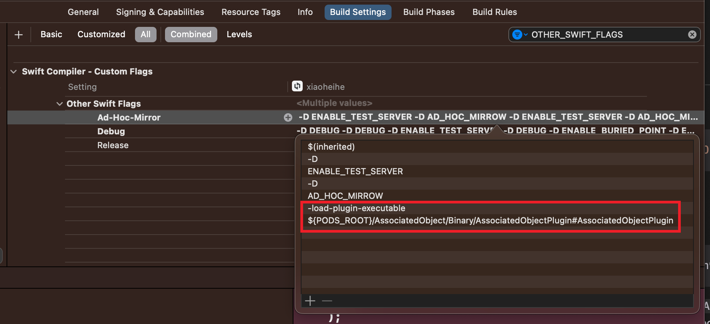

# AssociatedObject
Swift Macro for allowing variable declarations even in class extensions.
It is implemented by wrapping `objc_getAssociatedObject`/`objc_setAssociatedObject`.

<!-- # Badges -->

[](https://github.com/p-x9/AssociatedObject/issues)
[](https://github.com/p-x9/AssociatedObject/network/members)
[](https://github.com/p-x9/AssociatedObject/stargazers)
[](https://github.com/p-x9/AssociatedObject/)

## Installation

#### SPM
```swift
.package(url: "https://github.com/p-x9/AssociatedObject", from: "0.10.2")
```

#### CocoaPods
Add below to your `Podfile`.
```
pod 'AssociatedObject', git: 'https://github.com/p-x9/AssociatedObject', tag: '0.10.2'
```

After `pod install`, you can use this Macro in your project.

Additionally, if you encounter build error like `Expansion of macro 'AssociatedObject' did not produce a non-observing accessor`. You should check your project setting `Build Settings`-`OTHER_SWIFT_FLAGS`.

There should be additional flags like so.


If not, you can add these two lines by yourself.
```
-load-plugin-executable
${PODS_ROOT}/AssociatedObject/Binary/AssociatedObjectPlugin#AssociatedObjectPlugin
```

## Usage
For example, you can add a new stored property to `UIViewController` by declaring the following
```swift
import AssociatedObject

extension UIViewController {
    @AssociatedObject(.retain(nonatomic))
    var text = "text"

    /* OR */

    @AssociatedObject(.OBJC_ASSOCIATION_RETAIN_NONATOMIC)
    var text = "text"

    static var customKey = ""
    @AssociatedObject(.OBJC_ASSOCIATION_RETAIN_NONATOMIC, key: customKey)
    var somevar = "text"
}
```

Declared properties can be used as follows
```swift
class ViewController: UIViewController {
    override func viewDidLoad() {
        super.viewDidLoad()

        print(text) // => "text"

        text = "hello"
        print(text) // => "hello"
    }

}
```
### willSet/didSet
Properties defined using `@AssociatedObject` can implement willSet and didSet.
In swift, it is not possible to implement `willSet` and `didSet` at the same time as setter, so they are expanded as follows.

```swift
@AssociatedObject(.copy(nonatomic))
public var hello: String = "こんにちは" {
    didSet {
        print("didSet")
    }
    willSet {
        print("willSet: \(newValue)")
    }
}

// ↓↓↓ expand to ... ↓↓↓
public var hello: String = "こんにちは" {
    get {
        objc_getAssociatedObject(
            self,
            &Self.__associated_helloKey
        ) as? String
        ?? "こんにちは"
    }

    set {
        let willSet: (String) -> Void = { [self] newValue in
            print("willSet: \(newValue)")
        }
        willSet(newValue)

        let oldValue = hello

        objc_setAssociatedObject(
            self,
            &Self.__associated_helloKey,
            newValue,
            .copy(nonatomic)
        )

        let didSet: (String) -> Void = { [self] oldValue in
            print("didSet")
        }
        didSet(oldValue)
    }
}
```

## License
AssociatedObject is released under the MIT License. See [LICENSE](./LICENSE)
